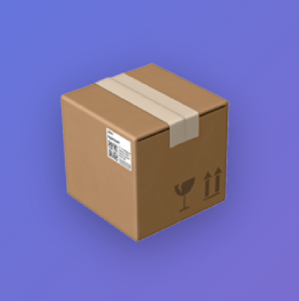

<p align="center">
  
</p>

# Snark Express

A cryptography paper aggregation platform inspired by Hacker News and zksecurity.xyz. Optimized for ePrint IACR papers with automatic metadata extraction, BibTeX generation, and LaTeX math rendering.

## Features

### Core Features
- **User Authentication**: Register and login with JWT-based authentication
- **Cryptographic Key Authentication**: Optional secp256k1-based key pair authentication (no password needed!)
- **Email Whitelist**: Optional email/domain whitelist for invitation-only registration
- **Paper Submission**: Submit papers by URL (optimized for eprint.iacr.org, also supports arXiv and DOI)
- **Automatic Metadata Extraction**: Automatically extracts title, abstract, authors, and BibTeX entries (10-30 seconds)
- **Math Formula Rendering**: KaTeX-powered LaTeX math rendering in abstracts (supports inline and display math)
- **Copy BibTeX**: One-click BibTeX copying to clipboard
- **Voting System**: Upvote papers you find interesting
- **Smart Ranking**: Papers ranked using a Hacker News-style algorithm (score/age)
- **Tag System**: Categorize papers with tags and filter by topic
- **Multiple Sort Options**: Sort by hot, top, or new
- **Comments System**: Nested comments with edit/delete functionality
- **User Profiles**: View user submissions, comments, and votes
- **Related Papers**: AI-powered paper recommendations and network visualization
- **Admin API**: Database management and statistics endpoints
- **Dark Mode**: Full dark mode support

## Tech Stack

### Backend
- Node.js + Express
- TypeScript
- SQLite (better-sqlite3)
- JWT for authentication
- bcryptjs for password hashing
- @noble/secp256k1 for cryptographic key authentication
- Axios + Cheerio for metadata extraction

### Frontend
- React 18
- TypeScript
- Vite
- Tailwind CSS
- React Router
- KaTeX for math rendering
- Axios

## Project Structure

```
paper-aggregator/
├── backend/
│   ├── src/
│   │   ├── database/
│   │   │   ├── db.ts              # Database connection
│   │   │   └── init.ts            # Database initialization
│   │   ├── middleware/
│   │   │   └── auth.ts            # JWT authentication
│   │   ├── routes/
│   │   │   ├── auth.ts            # Auth endpoints
│   │   │   ├── papers.ts          # Paper endpoints
│   │   │   └── admin.ts           # Admin endpoints
│   │   ├── types/
│   │   │   └── index.ts           # TypeScript types
│   │   ├── utils/
│   │   │   └── paperExtractor.ts  # Metadata extraction
│   │   └── server.ts              # Express server
│   ├── data/                      # SQLite database (auto-created)
│   ├── package.json
│   ├── tsconfig.json
│   └── .env                       # Environment variables
├── frontend/
│   ├── src/
│   │   ├── components/
│   │   │   ├── Header.tsx         # Site header
│   │   │   ├── PaperItem.tsx      # Paper display with math
│   │   │   ├── PaperList.tsx      # Paper list with filters
│   │   │   └── MathText.tsx       # KaTeX math renderer
│   │   ├── pages/
│   │   │   ├── Login.tsx          # Login page
│   │   │   ├── Register.tsx       # Registration page
│   │   │   └── Submit.tsx         # Paper submission
│   │   ├── App.tsx                # Main app component
│   │   ├── AuthContext.tsx        # Auth state management
│   │   ├── api.ts                 # API client
│   │   ├── types.ts               # TypeScript types
│   │   └── main.tsx               # Entry point
│   ├── package.json
│   ├── vite.config.ts
│   └── tailwind.config.js
├── start.sh                       # Quick start script
├── README.md                      # This file
├── QUICKSTART.md                  # Quick start guide
├── ADMIN_API.md                   # Admin API documentation
└── MATH_RENDERING.md              # Math rendering documentation
```

## Getting Started

### Quick Start (Recommended)

```bash
cd paper-aggregator
./start.sh
```

This will automatically:
- Install all dependencies
- Initialize the database
- Start both backend and frontend servers

### Manual Setup

#### 1. Set up the backend

```bash
cd paper-aggregator/backend
npm install

# Create .env file
cp .env.example .env

# Initialize the database
npm run init-db

# Run database migrations (for existing databases)
npm run migrate

# Start the backend server
npm run dev
```

The backend will run on `http://localhost:3001`

#### 2. Set up the frontend

```bash
cd paper-aggregator/frontend
npm install

# Start the frontend development server
npm run dev
```

The frontend will run on `http://localhost:3000`

## Usage

1. **Open your browser** and navigate to `http://localhost:3000`

2. **Register an account**:

   **Option A: Traditional Password Registration**
   - Click "register" in the header
   - Choose "Password" authentication method
   - Create a username, email, and password
   - You'll be automatically logged in

   **Option B: Cryptographic Key Registration** (Recommended for privacy!)
   - Click "register" in the header
   - Choose "Cryptographic Key" authentication method
   - Enter a username
   - Click "Generate Key Pair" to create a new key pair
   - **IMPORTANT**: Save your private key securely! This is the only time it will be shown.
   - Click "Copy Private Key" or "Download" to save it
   - Complete registration

   **Private Key Authentication Benefits**:
   - No password to remember - your private key IS your password
   - Login with just your private key (no username needed!)
   - Based on secp256k1 elliptic curve (same as Bitcoin)
   - More secure than traditional passwords
   - Privacy-focused: no email required for key-based registration

3. **Login**:

   **Password Login**: Enter username and password

   **Private Key Login**:
   - Select "Private Key" method
   - Paste your private key (automatically hidden with • characters)
   - Click eye icon to toggle visibility
   - No username needed - the system finds your account by your key!

4. **Submit a paper**:
   - Click "submit" in the header
   - Paste a paper URL (best: `https://eprint.iacr.org/2025/2097`)
   - Add tags (e.g., "zero-knowledge, cryptography")
   - Click submit

4. **Explore features**:
   - Vote on papers using the upvote arrow
   - Click "show details" to see abstract and BibTeX
   - Use "Copy BibTeX" button to copy to clipboard
   - Filter by tags in the sidebar
   - Sort by hot, top, or new

## Supported Paper Sources

### ePrint IACR (Primary)
- URL format: `https://eprint.iacr.org/2025/2097`
- Extracts: Title, authors, abstract, BibTeX, publication date
- BibTeX format matches ePrint standard

### arXiv
- URL format: `https://arxiv.org/abs/2203.11932`
- Uses arXiv API for metadata
- Auto-generates BibTeX

### DOI
- URL format: `https://doi.org/10.1145/3548606.3560593`
- Uses CrossRef API for metadata
- Auto-generates BibTeX

## Math Formula Support

Abstracts support LaTeX math formulas rendered with KaTeX:

- **Inline math**: `$O(n^2)$` or `\(x^2 + y^2\)`
- **Display math**: `$$E = mc^2$$` or `\[...\]`

Example:
```
The prover computes $\pi = g^{r_1} \cdot h^{r_2} \mod p$ in $\mathbb{G}$.
```

See [MATH_RENDERING.md](./MATH_RENDERING.md) for details.

## API Endpoints

### Authentication
- `POST /api/auth/register` - Register a new user (supports both password and public key)
  - Password: `{ username, email, password }`
  - Cryptographic Key: `{ username, publicKey }`
- `POST /api/auth/login` - Login (supports both methods)
  - Password: `{ username, password }`
  - Private Key: `{ privateKey }` (username optional, finds user by derived public key)

### Papers
- `GET /api/papers?tag=<tag>&sort=<hot|top|new>` - Get papers
- `POST /api/papers` - Submit a paper (requires authentication)
- `POST /api/papers/:id/vote` - Vote on a paper (requires authentication)
- `GET /api/papers/tags` - Get all tags

### Admin (requires admin key)
- `POST /api/admin/reset-database` - Reset database
- `GET /api/admin/stats` - Get database statistics

See [ADMIN_API.md](./ADMIN_API.md) for admin API details.

## Ranking Algorithm

Papers are ranked using a Hacker News-style algorithm:

```
score = (votes + 1) / (age_in_hours + 2)^1.8
```

This ensures:
- Recent papers with votes appear higher
- Papers gradually decay over time
- Balance between quality (votes) and recency

## Environment Variables

Create `backend/.env` file:

```env
PORT=3001
JWT_SECRET=your-secret-key-change-in-production
ADMIN_KEY=your-admin-key-change-in-production

# Email whitelist configuration (optional)
# Leave empty to allow all emails (open registration)
# Use comma-separated list for specific emails: user1@example.com,user2@example.com
# Use domains with @ prefix for domain whitelist: @university.edu,@company.com
ALLOWED_EMAILS=
```

### Email Whitelist

By default, registration is open to all users. To restrict registration to specific emails or domains:

**Allow specific emails:**
```env
ALLOWED_EMAILS=alice@example.com,bob@example.com,charlie@example.com
```

**Allow entire domains:**
```env
ALLOWED_EMAILS=@university.edu,@company.com
```

**Mixed (emails + domains):**
```env
ALLOWED_EMAILS=alice@example.com,@university.edu,@company.com
```

When the whitelist is enabled, users with non-whitelisted emails will see:
> "This email is not authorized to register. Please contact the administrator for an invitation."

## Development

### Backend Development

```bash
cd backend
npm run dev  # Uses ts-node for hot reload
```

### Frontend Development

```bash
cd frontend
npm run dev  # Vite dev server with hot reload
```

### Building for Production

**Backend**:
```bash
cd backend
npm run build
npm start
```

**Frontend**:
```bash
cd frontend
npm run build
npm run preview
```

## Database Management

### Reset Database

Using curl:
```bash
curl -X POST http://localhost:3001/api/admin/reset-database \
  -H "X-Admin-Key: snark-express-admin-key-2025"
```

### View Statistics

```bash
curl http://localhost:3001/api/admin/stats \
  -H "X-Admin-Key: snark-express-admin-key-2025"
```

## Documentation

- [QUICKSTART.md](./QUICKSTART.md) - Quick start guide
- [ADMIN_API.md](./ADMIN_API.md) - Admin API documentation
- [MATH_RENDERING.md](./MATH_RENDERING.md) - Math rendering guide
- [PROJECT_SUMMARY.md](./PROJECT_SUMMARY.md) - Detailed project summary

## Example Papers to Try

Test the platform with these papers:
- `https://eprint.iacr.org/2025/2097` - Hash-Based Blind Signatures
- `https://eprint.iacr.org/2024/1000` - Various cryptography papers
- `https://arxiv.org/abs/2203.11932` - arXiv example
- `https://doi.org/10.1145/3548606.3560593` - DOI example

## Troubleshooting

### Port Already in Use

```bash
# Kill process on port 3001 (backend)
lsof -ti:3001 | xargs kill -9

# Kill process on port 3000 (frontend)
lsof -ti:3000 | xargs kill -9
```

### Database Errors

If you encounter "no such column: public_key" errors:

```bash
cd backend
npm run migrate
```

To completely reset the database:

```bash
cd backend
rm -rf data/
npm run init-db
```

### Missing Dependencies

```bash
# Backend
cd backend
rm -rf node_modules package-lock.json
npm install

# Frontend
cd frontend
rm -rf node_modules package-lock.json
npm install
```

## Cryptographic Key Authentication

Snark Express supports passwordless authentication using secp256k1 elliptic curve cryptography (the same cryptography used in Bitcoin).

### How it Works

1. **Registration**:
   - User generates a key pair (private key + public key) in browser
   - Only the public key is sent to the server and stored
   - Private key stays with the user (never leaves the browser)
   - Username is set once during registration

2. **Login**:
   - User only needs to provide their private key
   - System derives the public key from the private key
   - Finds the user account by matching public keys
   - No username needed - the private key uniquely identifies you!

3. **Security**:
   - Private keys are 64-character hexadecimal strings (256-bit security)
   - Never stored on the server
   - Can be hidden with password-style masking (click eye icon to show/hide)
   - Based on battle-tested secp256k1 cryptography

### Key Management Tips

- **Save your private key securely** - treat it like a master password
- Use a password manager to store it
- Download it as a file and keep it safe
- If you lose it, you lose access to your account permanently (no password reset!)

## Features Roadmap

- [x] User authentication (password + cryptographic keys)
- [x] Paper submission and voting
- [x] ePrint IACR optimization
- [x] BibTeX extraction and copying
- [x] Math formula rendering
- [x] Admin API
- [x] Comment system
- [x] User profiles
- [x] Paper recommendations
- [x] Dark mode
- [ ] Email notifications
- [ ] RSS feeds
- [ ] Advanced search
- [ ] Nostr integration

## License

MIT

## Contributing

Contributions are welcome! Please feel free to submit a Pull Request.
